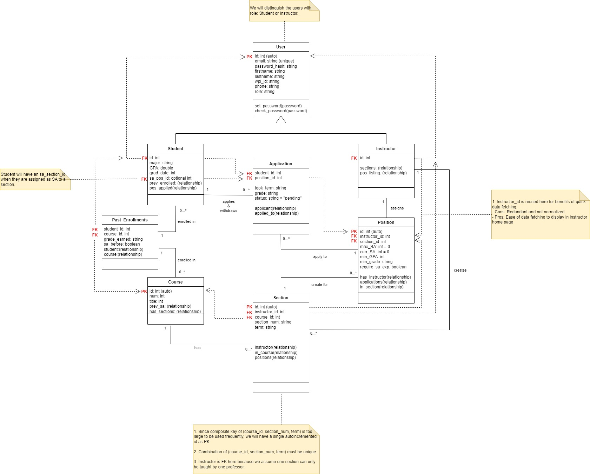
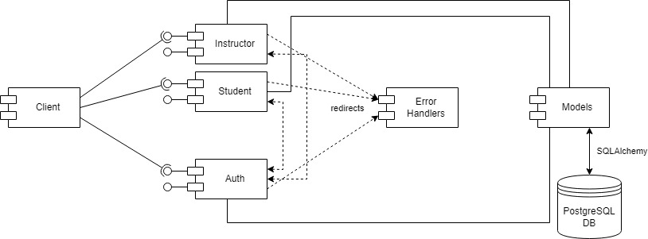

# Project Design Document

## CS 3733 - 2024 B Term Project
--------
Prepared by:

* `Khoi Dao`,`Flask-tasticCoders`
* `Gia Huy Pham`,`Flask-tasticCoders`
* `Tran Nguyen`,`Flask-tasticCoders`
* `Quan Dinh`,`Flask-tasticCoders`
---

**Course** : CS 3733 - Software Engineering 

**Instructor**: Sakire Arslan Ay

---

## Table of Contents
- [1. Introduction](#1-introduction)
- [2. Software Design](#2-software-design)
    - [2.1 Database Model](#21-model)
    - [2.2 Subsystems and Interfaces](#22-subsystems-and-interfaces)
    - [2.2.1 Overview](#221-overview)
    - [2.2.2 Interfaces](#222-interfaces)
    - [2.3 User Interface Design](#23-view-and-user-interface-design)
- [3. References](#3-references)

### Document Revision History

| Name | Date | Changes | Version |
| ------ | ------ | --------- | --------- |
|Revision 1 |2024-11-15 |Initial draft | 1.0        |
|Revision 2      |2021-11-19      |Second draft         |1.1         |

# 1. Introduction

This document provides documentation and keep track of changes for the database model, interfaces, and design of the software. 

- Revision 1: Created the base design of the software
- Revision 2: Modified the DB model and revised the URL routes to be RESTful

# 2. Software Design

## 2.1 Database Model

Brief descriptions of the tables in the database model: 

1. User Table
    - This table stores the common users' data of both instructor and student, such as login informationa and contact information
    - The table also have a role collumn to indicate if the user is a student or an instructor
2. Student Table
    - This table stores the specfic data of students such as GPA and major, and inherits from User
3. Instructor Table
    - This table stores the instructor's relationship with other tables, and inherits from User
4. Course Table
    - This table stores the predefined courses such as course number and title
5. Section Table
    - This table stores the sections of the courses
    - The table has relationship with instructor that teaches the section, the course itself, and the SA position listing
6. Position Table
    - This table stores required qualifications for SAshi, and serves as the SA postitions listing
    - The table has relationship with the specific section this position is in, and pending applications for the position
7. Past_Enrollments Table
    - This table signifies the relationship of Students with Courses that they have served as SA before, as well as if the student have taken a course and what grade they had
8. Application Table
    - This table stores the applications made by students and can be approves by instructors
    - Each application is related to a section.

The UML diagram of the database model
  <kbd>
      
  </kbd>

## 2.2 Subsystems and Interfaces

### 2.2.1 Overview

The major subsystems:
1. Client: the user that is interacting with the system
2. Student: stores the templates, routes, and forms for student's interfaces.
    - The student subsystem is isolated from the instructor
3. Instructor: stores the templates, routes, and forms for the instructor's interfaces
    - The instructor subsystem is isolated from the student
4. Authentication: stores the templates, routes, and forms for the authetication process
    - Can route the client to either the student or the instructor's interfaces depends on the role
5. Errors Handlers: stores the templates and routes for the errors
    - Errors that happened in subsystem Student, Instructor, or Authentication get redirected to here
6. Models: stores the database models and relationships
7. PostgreSQL DB: stores the data for the models using SQLAlchemy

The UML component diagram illustrating the software architectural design:
  <kbd>
      
  </kbd>

### 2.2.2 Interfaces

#### 2.2.2.1 \<Student> Routes

|   | Methods           | URL Path   | Description  |
|:--|:------------------|:-----------|:-------------|
|1. |GET                   |/student, /student/index            |Loads the index page for the application, including open SA positions listing and recommended SA positions              |
|2. |GET                |/student/profile            |Display student profile, including qualifcations and applications applied              |
|3. |PUT/PATCH                 |/student/profile/edits         |Edit student profile              |
|4. |POST                  |/student/application/<section_id>         |Apply for a section for an SA position              |
|5. |DELETE                |/student/application/<section_id>         |Withdraw application from a section              |

#### 2.2.2.1 \<Instructor> Routes

|   | Methods           | URL Path   | Description  |
|:--|:------------------|:-----------|:-------------|
|1. |GET                  |/instructor, /instructor/index            |Loads the index page for the application, including students applications and list of sections of the instructor              |
|2. |POST                 |/instructor/section        | Create new course section             |
|3. |POST                  |/instructor/section/<section_id>/position            |Create SA positions for course              |
|4. |GET                  |/instructor/student/<student_id>/profile            |View student profile to check for qualifications              |
|5. |POST                   |/instructor/position/<position_id>/<student_id>/            |Assigns student to be SA in an open position              |

#### 2.2.2.3 \<Authentication> Routes

|   | Methods           | URL Path   | Description  |
|:--|:------------------|:-----------|:-------------|
|1. |POST                   |/login            |Connects to the login page              |
|2. |GET                   |/register            |Asks for the role that the user wants to create the account for, and redirects to next step              |
|3. |POST                   |/student/register            |Connects to the register page for student              |
|4. |POST                  |/instructor/register            |Connects to the register page for instructor              |
|5. |POST                   |/logout            | Connects to the logout page             |

#### 2.2.2.4 \<Errors> Routes

|   | Methods           | URL Path   | Description  |
|:--|:------------------|:-----------|:-------------|
|1. |GET                   |/error/404            |Shows the 404 error page              |
|2. |GET                   |/error/500            |Shows the 500 error page              |

Repeat the above for other subsystems you included in your application. 

### 2.3 User Interface Design 

User-stories: 1
<kbd>
      
</kbd>

User-stories: 2
<kbd>
      
</kbd>

User-stories: 3, 4
<kbd>
      
</kbd>

User-stories: 3, 4, 5
<kbd>
      
</kbd>

User-stories: 6, 7
<kbd>
      
</kbd>

User-stories: 8
<kbd>
      
</kbd>

User-stories: 9
<kbd>
      
</kbd>

User-stories: 10
<kbd>
      
</kbd>

User-stories: 11
<kbd>
      
</kbd>

User-stories: 12
<kbd>
      
</kbd>

User-stories: 12, 13, 14
<kbd>
      
</kbd>

# 3. References

UI References, Dribble: [Source](https://dribbble.com/tags/job-listing)

----