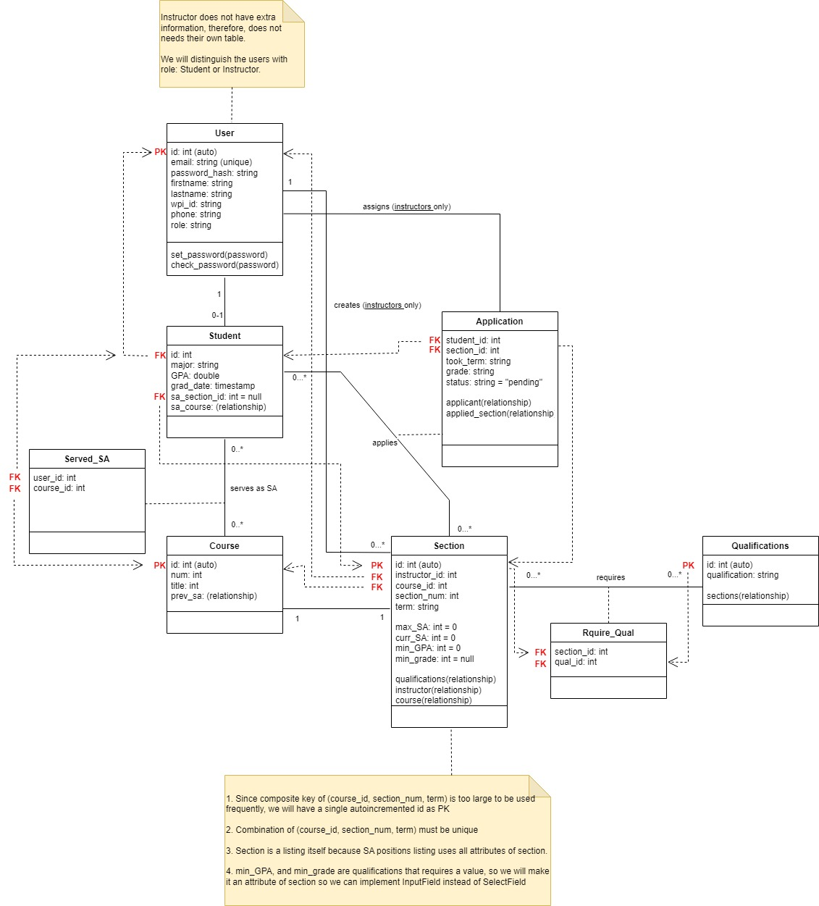

# Project Design Document

## CS 3733 - 2024 B Term Project
--------
Prepared by:

* `Khoi Dao`,`Flask-tasticCoders`
* `Gia Huy Pham`,`Flask-tasticCoders`
* `Tran Nguyen`,`Flask-tasticCoders`
* `Quan Dinh`,`Flask-tasticCoders`
---

**Course** : CS 3733 - Software Engineering 

**Instructor**: Sakire Arslan Ay

---

## Table of Contents
- [1. Introduction](#1-introduction)
- [2. Software Design](#2-software-design)
    - [2.1 Database Model](#21-model)
    - [2.2 Subsystems and Interfaces](#22-subsystems-and-interfaces)
    - [2.2.1 Overview](#221-overview)
    - [2.2.2 Interfaces](#222-interfaces)
    - [2.3 User Interface Design](#23-view-and-user-interface-design)
- [3. References](#3-references)
- [Appendix: Grading Rubric](#appendix-grading-rubric)

### Document Revision History

| Name | Date | Changes | Version |
| ------ | ------ | --------- | --------- |
|Revision 1 |2024-11-15 |Initial draft | 1.0        |
|      |      |         |         |

# 1. Introduction

Explain the purpose of this document. If this is a revision of an earlier document, please make sure to summarize what changes have been made during the revision (keep this discussion brief). 

This document provides documentation and keep track of changes for the database model, interfaces, and design of the software. 

- Revision 1: Created the base design of the software

# 2. Software Design

(**Note**: For all subsections of Section-2: You should describe the design for the end product (completed application) - not only your iteration1 version. You will revise this document and add more details later.)

## 2.1 Database Model

Provide a list of your tables (i.e., SQL Alchemy classes) in your database model and briefly explain the role of each table. 

1. User Table
    - This table stores the common users' data of both faculty and student, such as login informationa and contact information
    - The table also have a role collumn to indicate if the user is a student or an instructor
    - Instructor does not have data beyond user, so they do not have a seperate table
2. Student Table
    - This table stores the specfic data of students such as GPA and major
3. Course Table
    - This table stores the predefined courses such as course number and title
4. Section Table
    - This table stores the sections of the courses, and serves as the SA postitions listing
    - The table has relationship with instructor that teaches the section and the course
    - Stores required qualifications that have values (ex: min GPA requires an integer)
5. Served_SA Table
    - This table signifies the relationship of Students with Courses that they have served as SA before
    - The table stores the primary keys which linked the many-to-many relationship
6. Application Table
    - This table signifies the relationship of Students who applies to be SA in Sections, or SA applications
    - The table stores the primary keys which linked the many-to-many relationship
    - Additionally, it also stores application data such as application status and term applying
7. Qualification Table
    - This table stores the qualifications that is required to be SA in a section
    - Different from the qualifications stored in Section, this table does not store values (ex: "has SA experience before", "has SA this course before")
8. Require_Qual Table
    - This table signifies the relationship of Sections requires Qualifications
    - The table stores the primary keys which linked the many-to-many relationship

Provide a UML diagram of your database model showing the associations and relationships among tables. 

The UML diagram of the database model
  <kbd>
      
  </kbd>

## 2.2 Subsystems and Interfaces

### 2.2.1 Overview

Describe the high-level architecture of your software:  i.e., the major subsystems and how they fit together. Provide a UML component diagram that illustrates the architecture of your software. Briefly mention the role of each subsystem in your architectural design. Please refer to the "System Level Design" lectures in Week 4. 

### 2.2.2 Interfaces

Include a detailed description of the routes your application will implement. 
* Brainstorm with your team members and identify all routes you need to implement for the **completed** application.
* For each route specify its “methods”, “URL path”, and “a description of the operation it implements”.  
* You can use the following table template to list your route specifications. 
* Organize this section according to your subsytem decomposition, i.e., include a sub-section for each subsytem and list all routes for that sub-section in a table.  

#### 2.2.2.1 \<Main> Routes

|   | Methods           | URL Path   | Description  |
|:--|:------------------|:-----------|:-------------|
|1. |index()                   |/, /index            |Loads the index page for the application              |
|2. |create_course_section()                   |/courses/create-course            | create new course section             |
|3. |create_positions()                   |/courses/create-position            |create SA positions for course              |
|4. |display_profile()                |/student/profile            |display student profile              |
|5. |edit_profile()                  |/student/edit           |edit student profile              |

#### 2.2.2.2 \<Authentication> Routes

|   | Methods           | URL Path   | Description  |
|:--|:------------------|:-----------|:-------------|
|1. |login()                   |/login            |Connects to the login page              |
|2. |student_register()                   |student/register            |Connects to the register page for student              |
|3. |instructor_register()                   |instructor/register            |Connects to the register page for instructor              |
|4. |logout()                   |/logout            | Connects to the logout page             |
|5. |                   |            |              |
|6. |                   |            |              |

#### 2.2.2.2 \<Errors> Routes

|   | Methods           | URL Path   | Description  |
|:--|:------------------|:-----------|:-------------|
|1. |not_found_error()                   |/error/404            |Shows the 404 error page              |
|2. |internal_error()                   |/error/500            |Shows the 500 error page              |

Repeat the above for other subsystems you included in your application. 

### 2.3 User Interface Design 

Provide a list of the page templates you plan to create and supplement your description with UI sketches or screenshots. Make sure to mention which user-stories in your “Requirements and Use Cases" document will utilize these interfaces for user interaction. 

# 3. References

Cite your references here.

For the papers you cite give the authors, the title of the article, the journal name, journal volume number, date of publication and inclusive page numbers. Giving only the URL for the journal is not appropriate.

For the websites, give the title, author (if applicable) and the website URL.

----
# Appendix: Grading Rubric
(Please remove this part in your final submission)

 * You will first  submit a draft version of this document:
    * "Project 3 : Project Design Document - draft" (5pts). 
* We will provide feedback on your document and you will revise and update it.
    * "Project 5 : Project Design Document - final" (80pts) 

Below is the grading rubric that we will use to evaluate the final version of your document. 

|**MaxPoints**| **Design** |
|:---------:|:-------------------------------------------------------------------------|
|           | Are all parts of the document in agreement with the product requirements? |
| 8         | Is the architecture of the system ([2.2.1 Overview](#221-overview)) described well, with the major components and their interfaces?         
| 8        | Is the database model (i.e., [2.1 Database Model](#21-database-model)) explained well with sufficient detail? Do the team clearly explain the purpose of each table included in the model?| 
|          | Is the document making good use of semi-formal notation (i.e., UML diagrams)? Does the document provide a clear UML class diagram visualizing the DB model of the system? |
| 18        | Is the UML class diagram complete? Does it include all classes (tables) and does it clearly mark the PK and FKs for each table? Does it clearly show the associations between them? Are the multiplicities of the associations shown correctly? ([2.1 Database Model](#21-database-model)) |
| 25        | Are all major interfaces (i.e., the routes) listed? Are the routes explained in sufficient detail? ([2.2.2 Interfaces](#222-interfaces)) |
| 13        | Is the view and the user interfaces explained well? Did the team provide the screenshots of the interfaces they built so far.  ([2.3 User Interface Design](#23-user-interface-design)) |
|           | **Clarity** |
|           | Is the solution at a fairly consistent and appropriate level of detail? Is the solution clear enough to be turned over to an independent group for implementation and still be understood? |
| 5         | Is the document carefully written, without typos and grammatical errors?  |
| 3         | Is the document well formatted? (Make sure to check your document on GitHub. You will loose points if there are formatting issues in your document.  )  |
|           |  |
| 80         | **Total** |
|           |  |
