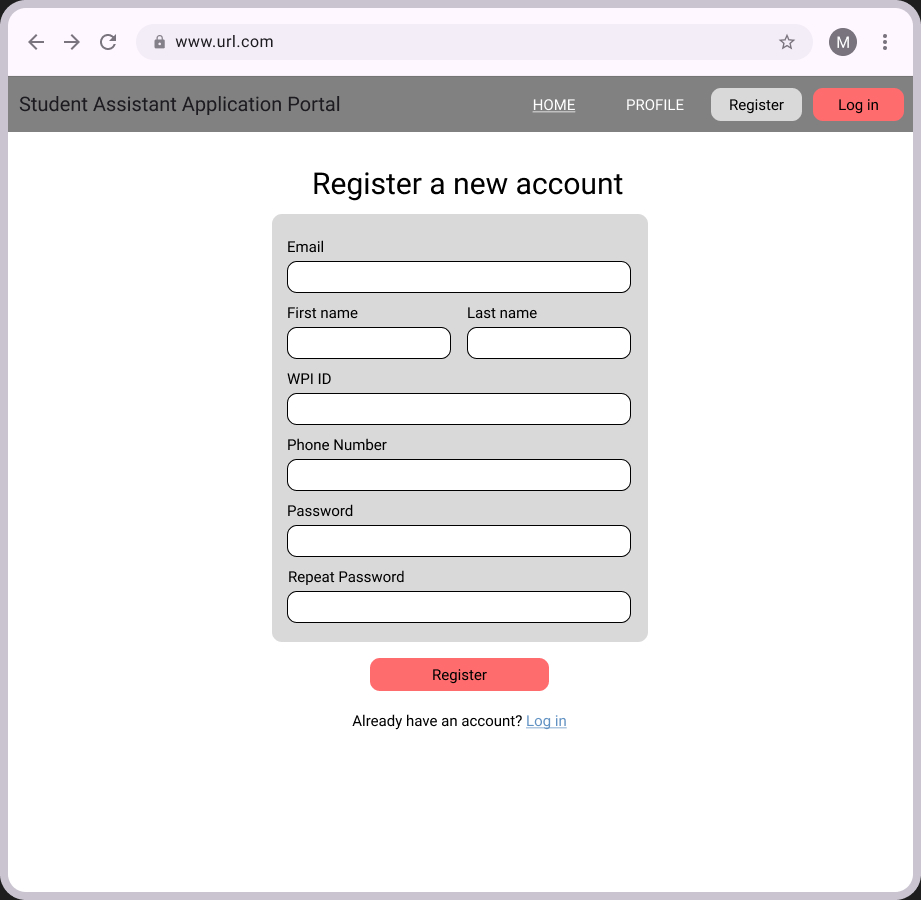
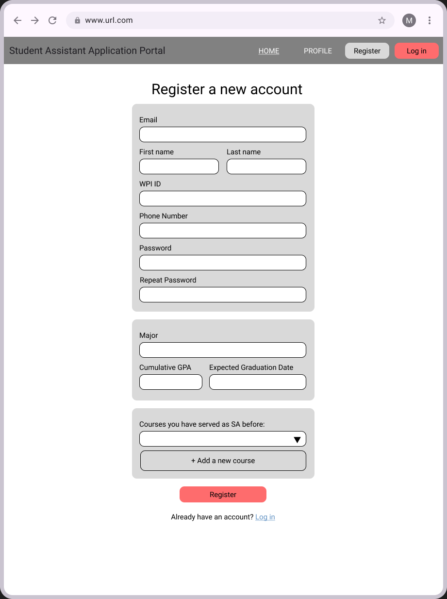
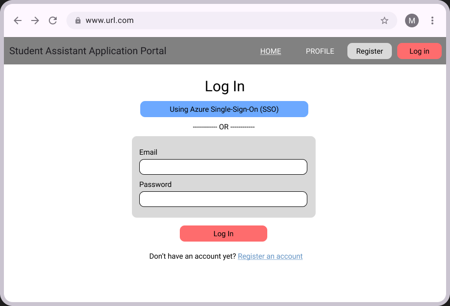
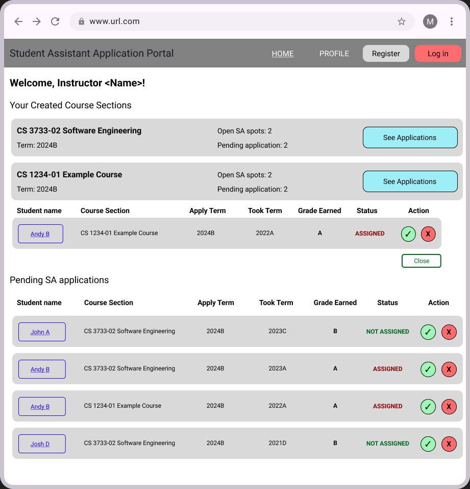
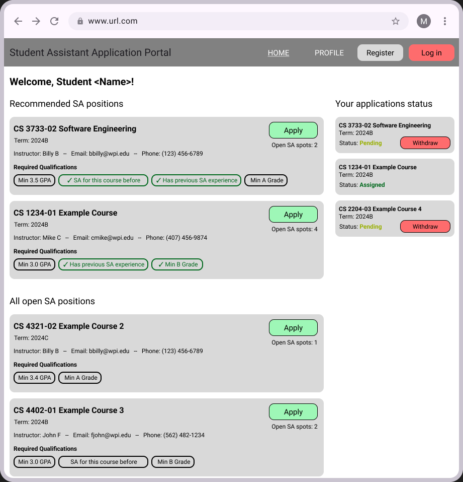

# Software Requirements and Use Cases

## CS 3733 - 2024 B Term Project
--------
Prepared by:

* `Khoi Dao`,`Flask-tasticCoders`
* `Gia Huy Pham`,`Flask-tasticCoders`
* `Tran Nguyen`,`Flask-tasticCoders`
* `Quan Dinh`,`Flask-tasticCoders`

---

**Course** : CS 3733 - Software Engineering

**Instructor**: Sakire Arslan Ay

---

## Table of Contents
- [1. Introduction](#1-introduction)
- [2. Requirements Specification](#2-requirements-specification)
  - [2.1 Customer, Users, and Stakeholders](#21-customer-users-and-stakeholders)
  - [2.2 User Stories](#22-user-stories)
  - [2.3 Use Cases](#23-use-cases)
- [3. User Interface](#3-user-interface)
- [4. Product Backlog](#4-product-backlog)
- [5. References](#5-references)

## Document Revision History

| Name | Date | Changes | Version |
| ------ | ------ | --------- | --------- |
|Revision 1 |2024-11-07 |Initial draft | 1.0        |
|      |      |         |         |
|      |      |         |         |

----
# 1. Introduction

The purpose of this web application is to improve the undergraduate Student Assistants (SAs) recruitment process. Computer Science Department can recruit SA for the introductary level courses and lab sections.

The application allow seemless interactions between the instructors and students. Students who are interested in SA positions can create accounts, and enter contact information as well as course preferences. Instructors can choose the student assistants among the students who are interested in their course.

The goal of the application is to help shifting SA application process from manual to online.

----
# 2. Requirements Specification

This section specifies the software product's requirements. Specify all of the software requirements to a level of detail sufficient to enable designers to design a software system to satisfy those requirements, and to enable testers to test that the software system satisfies those requirements.

## 2.1 Customer, Users, and Stakeholders

The users of this software includes 
- Undergraduate students who are interested in SA positions
- Computer Science instructors who need SAs for their courses

----
## 2.2 User Stories

1. "As a **[student]**, I want **[to register a student account]** so that **[I can start applying for a student assistant position ]**. I want to be able to enter my WPI email as username, password, contact information (name, last name, WPI ID, email, phone), additional information (major, cumulative GPA, expected graduation date, etc.), and select courses that I have served as SA before "
2. "As a **[student]**, I want **[to log in using a student account with WPI email and password or with Azure Single Sign-On service]** "
3. "As a **[student]**, I want **[to view open SA positions]** so that **[I can choose my course preferences for student assistantships]**. I want to view various information such as course number, section, title, term, instructor's name and contact information, and qualifications needed for the SA position "
4. "As a **[student]**, I want **[to see recommended SA positions]** so that **[I see which courses I have served as an SA before or if I took those course and got an A]** "
5. "As a **[student]**, I want **[to apply for SA positions]** so that **[the instructor can be notified that I want to be SA in their course section]**. I want to be able to apply for more than one SA position. For applying, I want to be able to enter information such as the grade I earned when I took the course, the term I took the course, and the term I am applying for SAship. "
6. "As a **[student]**, I want **[to view the applications and I haved created and check their status]** so that **[I know if I have been assigned to a course section or not]**. I want to see the status "Assigned" if an instructor has approved my application, else, I want to see status "Pending" "
7. "As a **[student]**, I want **[to withdraw pending applications]** so that **[I can remove the applications if I am no longer interested in the course section]**. I want to be able to withdraw only pending application, before the instructor finalize their decision to assign me "
8. "As a **[instructor]**, I want **[to register an instructor account]** so that **[I can start creating course sections and SA positions listings]**. I want to be able to enter my WPI email as username, password, contact information (name, last name, WPI ID, email, phone) "
9. "As a **[instructor]**, I want **[to log in using an instructor account with WPI email and password or with Azure Single Sign-On service]** "
10. "As a **[instructor]**, I want **[to add a new course section that I am going to teach]** so that **[students can request to be SA in my section]**. I want to choose the course from the course catalog then enter the course section and term. I want to have the course section to be unique so that I can understand which one is mine "
11. "As a **[instructor]**, I want **[to choose my course section and then create SA positions listing for the course]** so that **[students knows my course sections needs certain SAs]**. I want to set the amount of SAs needed for the section and qualifications needed for the course. "
12. "As a **[instructor]**, I want **[to see the students who has applied to be my course section's SA]** so that **[I can assigned some students to be the course's SA]**. I want to see whether that student has been assigned to another course so that I can qualify other students.  "
13. "As a **[instructor]**, I want **[to view the qualifications of each student that applied]** so that **[I can see if they are qualified enough for my course section's SAship]**. I want to see information such as GPA, grades earned in their classes, and courses they have served as SA before. "
14. "As a **[instructor]**, I want **[to approve student applications]** so that **[they can officially be assinged as an SA for my course section]**. I do not want to assign students that have already been assigned to another section. "
15. "As a **[instructor]**, I want **[to make sure that each student is only assigned to a single SA position]** so that **[they are not assigned to multiple different course sections]** "
16. "As a **[instructor]**, I want **[to have a concrete number of SA for the sections]** so that **[I do not over assigned SAs to my course section]** "

----
## 2.3 Use Cases

Use cases for log in and register a new account is not provided.

On the student page, a student user can:

| Use case # 1     |   |
| ------------------ |--|
| Name              | View open SA positions  |
| Participating actor  | Student  |
| Entry condition(s)     | Student is registered and logged in  |
| Exit condition(s)           | The software displays all available SA positions |
| Flow of events | 1. User go to the home page   2. Software displays all available SA positions with various information: course number, section, title, term, instructor's name and contact information, and qualifications needed for the SA position |
| Alternative flow of events    | If there are no SA positions listing available, the software will display a message to tell the user that no positions are opened. If the course sections have full SA positions, the software will not display those course sections  |
| Iteration #         | Iteration 2  |

| Use case # 2     |   |
| ------------------ |--|
| Name              | View recommended SA positions  |
| Participating actor  | Student  |
| Entry condition(s)     | Student is registered and logged in  |
| Exit condition(s)           | The software displays recommended SA positions based on matching criterias |
| Flow of events | 1. User go to the home page   2. Software displays open SA positions sorted by if the user has served as an SA for the course before, or if the user has taken the course before and had an A, or both   3. Software displays what criterias are met |
| Alternative flow of events    | If there are no SA recommendations available, the software will display a message to tell the user that there are no recommendations.  |
| Iteration #         | Iteration 3  |

| Use case # 3     |   |
| ------------------ |--|
| Name              | Apply for SA positions  |
| Participating actor  | Student  |
| Entry condition(s)     | Student is registered and logged in  |
| Exit condition(s)           | The software successfully submits the application to the section instructor  |
| Flow of events | 1. User click apply on a course section that they want to be SA in   2. Software display form fields that user can enter information such as the grade they earned for the course, the year they took the course, and the term they are applying for SAship   3. User confirms their inputs   4. Software notifies the user that their application succeed  |
| Alternative flow of events    | If the user already applied for the course, the software will notify the user that they have already submitted an application  |
| Iteration #         | Iteration 2  |

| Use case # 4     |   |
| ------------------ |--|
| Name              | Check SA applications status  |
| Participating actor  | Student  |
| Entry condition(s)     | User is registered and logged in   |
| Exit condition(s)           | Software displays the status of the user's applications  |
| Flow of events | 1. User goes to the page that display application status   2. Software list user's application status, with information such as the course number, section number, title, and status "Pending" if the application is not approved  |
| Alternative flow of events    | If the user's application is approved, the status will display as "Assigned"  |
| Iteration #         | Iteration 3  |

| Use case # 5     |   |
| ------------------ |--|
| Name              | Withdraw pending SA applications  |
| Participating actor  | Student  |
| Entry condition(s)     | User is registered and logged in. User also have applied for SAships and have "Pending" applications  |
| Exit condition(s)           | Software removes the applications that the user withdrawed  |
| Flow of events | 1. User go the page that display application status   2. Software list user's application status, with an option to withdraw applications with status "Pending"   3. User chooses the application they want to withdraw   4. The software removes the application from the application status page  |
| Alternative flow of events    | If the user's application has status "Assigned", the user will not have the option to withdraw from that section.  |
| Iteration #         | Iteration 3  |

On the instructor page, a faculty user can:

| Use case # 6     |   |
| ------------------ |--|
| Name              | Add course sections  |
| Participating actor  | Faculty user  |
| Entry condition(s)     | User is registered and logged in  |
| Exit condition(s)           | Software adds a new course section  |
| Flow of events | 1. User go to the page that can add new course section   2. Software asks the user to choose from a predetermined list of courses to choose the course   3. User choose the course that they will teach   4. Software askes user to input the course section and the term.   5. User inputs the course section and the term   6. Software adds the new course section  |
| Alternative flow of events    | If the course section already exists, the software will notify the user that combination of course number, section, and term must be unique.  |
| Iteration #         | Iteration 1  |

| Use case # 7     |   |
| ------------------ |--|
| Name              | Create SA positions  |
| Participating actor  | Faculty user  |
| Entry condition(s)     | User is registered and logged in. User also have created the course sections that they want to create SA positions in.  |
| Exit condition(s)           | Software adds SA positions as open positions  |
| Flow of events | 1. User go to the page that can add new SA positions   2. Software asks the user to choose from a list of sections that they have created   3. User chooses the section that they want to create SA positions in   4. Software asks the user to enters the number of SAs needed for the course section   5. User enters the number of SAs that they want   6. Software asks user to enter or select the qualifications needed for SAships: min GPA, min Grade earned for the course, prior SA experiences, or has SA for this course before   6. User chooses the required qualifications for SAship   7. Software adds a new SA position(s) listing  |
| Alternative flow of events    | If the course section already have an open SA positions listing, the software will notify the user that they cannot make more listing for the same section.  |
| Iteration #         | Iteration 1  |

| Use case # 8     |   |
| ------------------ |--|
| Name              | View students applications  |
| Participating actor  | Faculty user  |
| Entry condition(s)     | User is registered and logged in  |
| Exit condition(s)           | Software displays all the applications that the student has applied for the user's course sections  |
| Flow of events | 1. User go to the page that display students applications   2. Software display a list of applications that have information such as the student's name, the course section they apply to, the term they took and apply for, the grade they earned for the course, and the status of the applicant's SAship  |
| Alternative flow of events    | If the applicant has already been assigned to another course, the status of their application will be displayed as "ASSIGNED". Else, the software will display their status as "NOT ASSIGNED"  |
| Iteration #         | Iteration 2  |

| Use case # 9     |   |
| ------------------ |--|
| Name              | View students qualifications  |
| Participating actor  | Faculty user  |
| Entry condition(s)     | User is registered and logged in. There are students who already applied for the user's course sections for SAship  |
| Exit condition(s)           | Software displays the student's qualifications  |
| Flow of events | 1. User go to the page that display the students applications   2. Software display a list of applications   3. User choose a student that they want to view the qualifications   4. Software displays the qualifications of the selected students: GPA, courses they served as SA before, major, grades they earned for the courses  |
| Alternative flow of events    | No alternative flow  |
| Iteration #         | Iteration 3  |

| Use case # 10      |   |
| ------------------ |--|
| Name              | Assign student to SA position  |
| Participating actor  | Faculty user  |
| Entry condition(s)     | User is registered and logged in. There area students who already applied for the user's course sections for SAship  |
| Exit condition(s)           | Software assignes the student to the course section, and remove one open position from the SA positions listing for that course  |
| Flow of events | 1. User go to the page that display students applications   2. Software dispaly a list of applications   3. User choose approve on a student application   4. Software assigns the student to the course section, change the applicant's status to "ASSIGNED", and remove one open spot form the SA postions listing for that course section  |
| Alternative flow of events    | If the applicant have already been assinged to another course, the user cannot choose to approve that student application. If the course is already full in SA positions, but there are still applications for that section left, the user cannot choose to approve those applications and the software will notify the user that the course section is full.  |
| Iteration #         | Iteration 3  |

----
# 3. User Interface

The sketches or mockups for the main parts of the interface.

The UI for registering as an instructor
  <kbd>
      
  </kbd>

The UI for registering as a student
  <kbd>
      
  </kbd>

The UI for logging in
  <kbd>
      
  </kbd>

The UI for instructor view that show course sections and applications for those sections
  <kbd>
      
  </kbd>

The UI for student view that show all SA positions and the SA applications that the students have submitted
  <kbd>
      
  </kbd>
  
----
# 4. Product Backlog

Github Issues: [Issues URL](https://github.com/WPI-CS3733-2024B/termproject-flask-tasticcoders/issues)

----
# 5. References

"What is single sign-on in Microsoft Entra ID?", Microsoft Ignite, 9/30/2024: [Source](https://learn.microsoft.com/en-us/entra/identity/enterprise-apps/what-is-single-sign-on)
UI References, Dribble: [Source](https://dribbble.com/tags/job-listing)

----
----

